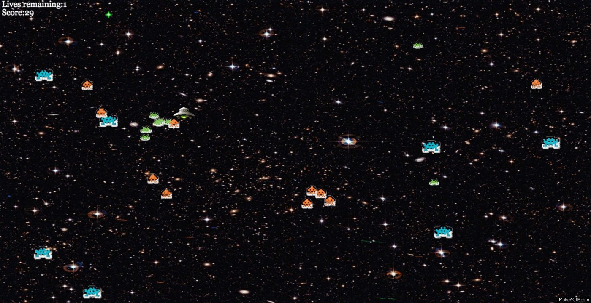

# SpaceWars
[Click here to play!](https://dammo001.github.io/spacewarsworking)

## Description
Destroy the aliens!

SpaceWars is a simple browser-based shooter game built entirely with JavaScript and HTML5 Canvas.

## Features
* Game mechanics built from the ground up, including collision detection, scoring, respawning, enemy AI etc.
* Sprite-based drawings and animations done with HTML5 Canvas
* Utilizes prototypal inheritance for creating the different types of moving objects

## Things to Come
* [ ] Smarter/safer spawning for player's character
* [ ] Spawn enemies at defined points
* [ ] Global leaderboard (utilizing a cloud DB)
* [ ] More stages for clearer gradation of difficulty, more enemy types
* [ ] Powerups
* [ ] More weapons?!
* [x] Sound effects!